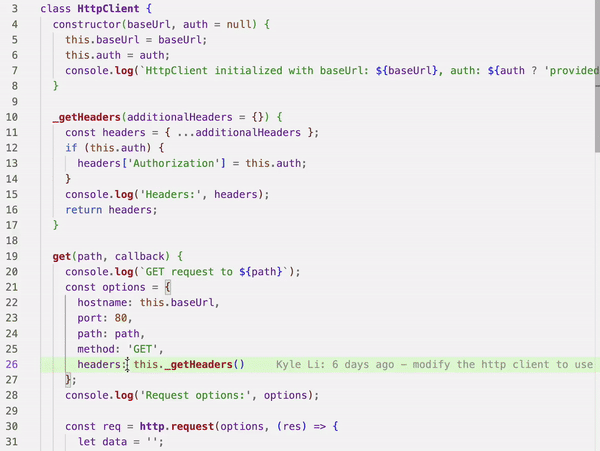
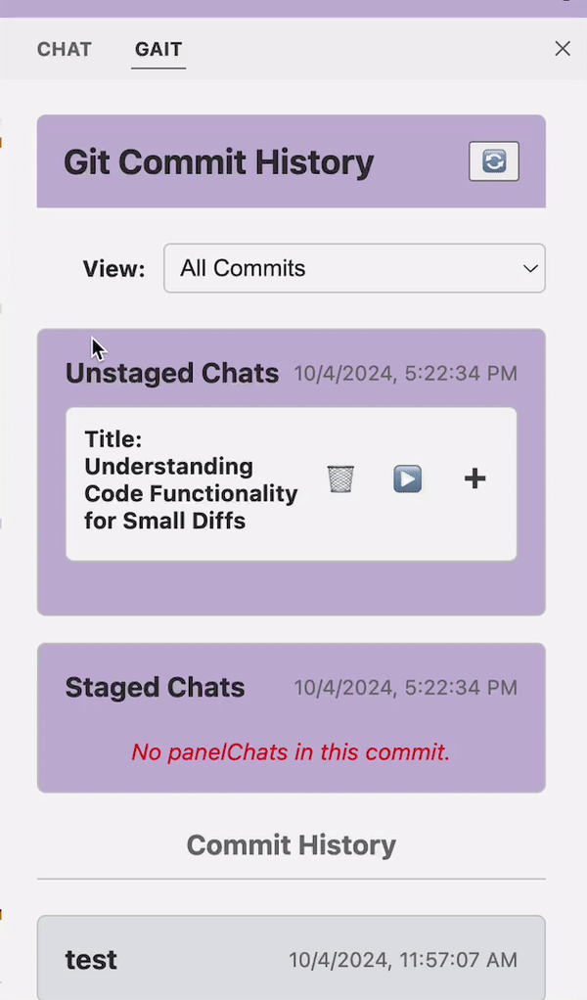

# gait

Welcome to gait, an extension for storing and sharing Github Copilot or Cursor prompts and conversations!

## Usage

### gait Automatically Records Cursor + Copilot Chats

No work on your end. There might be some delay! 

### AI blame: Viewing Chats



Hover over AI-generated code to see the prompt that led to that particular code snippet. 
The other lines generated by that prompt get highlighted as well. **Prompts are like automatic documentation.** 

### Managing Chats: Stage, Unstage, and Delete 


Chats that result in code get automatically written to file to be committed. If there's any reason you'd like to hide a chat, you can manually "stage" and "unstage" chats -  - **treat chats like diffs**.
1. Open the gait side view by clicking on the gait icon in the Activity Bar.
2. Use the Panel View to stage or unstage chats
3. **IMPORTANT**: when you commit, 

```
> git add .gait/
```


### Toggling Annotations (Hover and Highlight)

Use the keyboard shortcut `Cmd+Shift+G` to toggle full color highlights on and off.

### Continuing a Chat

1. Select a previous chat from the Panel View.
2. Click the "resume" button to continue the chat.
3. Gait will provide all necessary context, including prompts and context files, in a markdown file.


## Features

1. **Automatic Chat Capture**: Gait automatically captures your inline chats and panel chats.
2. **Chat Management**: Manage panel chats in the UI - stage and unstage them like files in a commit.
3. **AI-Blame**: Hover over AI-generated code to view the prompt that led to that commit.
4. **Decoration Toggle**: Easily toggle decorations (hover and highlights) with a keyboard shortcut.
5. **Continuous Chat**: Pick up where you or your coworker left off by continuing the chat.

## Support

If you encounter any issues or have questions, text me or call me at 408-680-6718 or email founders@getgait.com

Happy coding with gait!

## Known Issues

Please report any issues to us directly - founders@getgait.com or in the forum!

Latency - It takes some time for the metadata to show up for us to read in Cursor/Copilot!
Inline chats - We don't have a super clean way of capturing your diffs, they may be delayed or missing!
