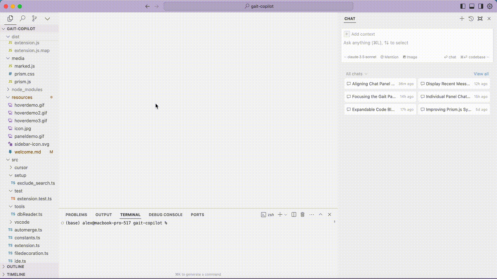
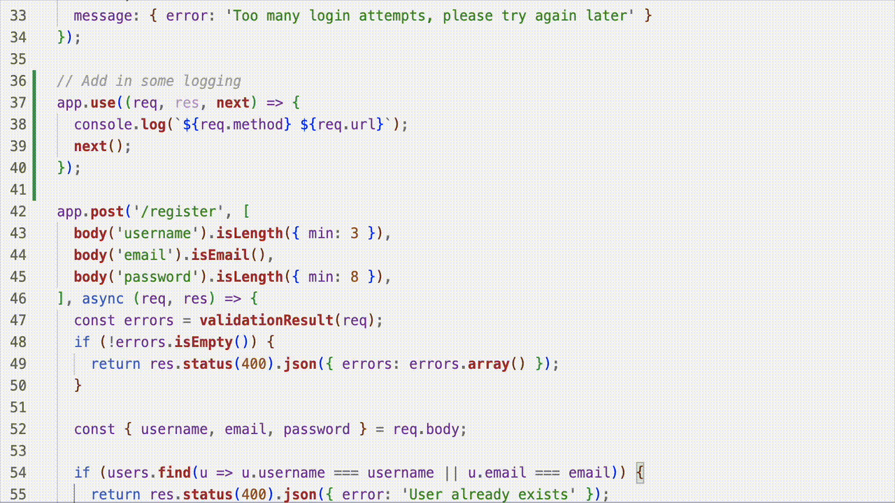
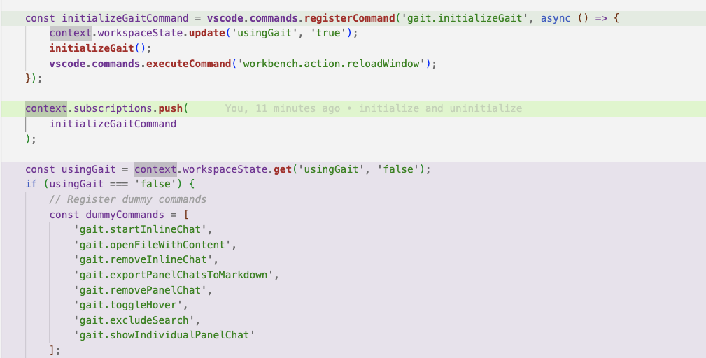

# Getting Started with gait

Welcome to gait, your intelligent companion for storing and sharing codegen prompts and conversations in VS Code or Cursor!

## Usage

### 1. Drag Gait Panel to Right Side

We recommend dragging the gait panel to the right side of your screen, in the same group as Cursor's side panel.



### 2. gait Automatically Records Chats

No work on your end. There might be some delay! 

### 3. gait blame: Viewing Saved Chats



Hover over AI-generated code to see the prompt that led to that particular code snippet.

**IMPORTANT NOTE**: When you first start gait, the extension will read the chats in your history and attempt to match 
them to files. View chats that have "matched" pieces of code in the STAGED CHATS section. 

### 4. highlight mode: Toggle using Command-Shift-G

See all the code in a file that has been AI-generated. Colors correspond to one message.




### 5. Stage, Unstage, and Delete Chats


1. Open the gait side view by clicking on the gait icon in the Activity Bar.
2. Use the Panel View to stage or unstage chats, similar to managing files in a Git commit.
3. **IMPORTANT**: when you commit, 

```
> git add .gait/
```

### 6. Continuing a Chat

1. Select a previous chat from the Panel View.
2. Click the "resume" button to continue the chat.
3. Gait will provide all necessary context, including prompts and context files, in a markdown file.


## Features

1. **Automatic Chat Capture**: Gait automatically captures your inline chats and panel chats.
2. **Chat Management**: Manage panel chats in the UI - stage and unstage them like files in a commit.
3. **AI-Blame**: Hover over AI-generated code to view the prompt that led to that commit.
4. **Decoration Toggle**: Easily toggle decorations (hover and highlights) with a keyboard shortcut.
5. **Continuous Chat**: Pick up where you or your coworker left off by continuing the chat.

## Support

If you encounter any issues or have questions, text me or call me at 408-680-6718 or email founders@getgait.com

Happy coding with gait!